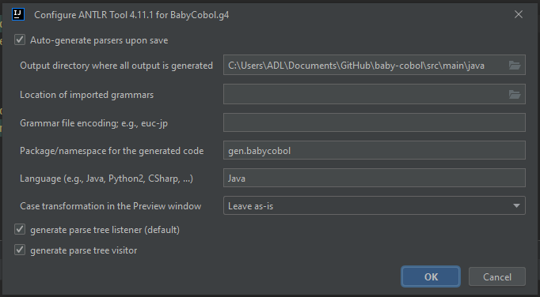

# baby-cobol
BabyCobol compiler for Software Evolution course
Written using ANTLR and Java

## Setup for developers
1. Install ANTLR plug-in on IntelliJ IDEA https://plugins.jetbrains.com/plugin/7358-antlr-v4
2. Run "mvn install" to install Maven dependencies
3. If you get an error regarding "invalid target release", refer to this page https://stackoverflow.com/questions/73132312/spring-boot-fatal-error-compiling-invalid-target-release-17
4. Configure ANTLR for BabyCobol.g4 file

## Development
1. Add lexer grammar in BCTokens.g4 file
2. Add parser grammar in BabyCool.g4 file
3. Generate ANTLR Recognizer for BabyCobol.g4 file
4. Add logic in BabyCobolCustomListener.java or BabyCobolCustomVisitor.java files

## Testing
1. Add new syntax to main.bcbl
2. Run main function in Main.java